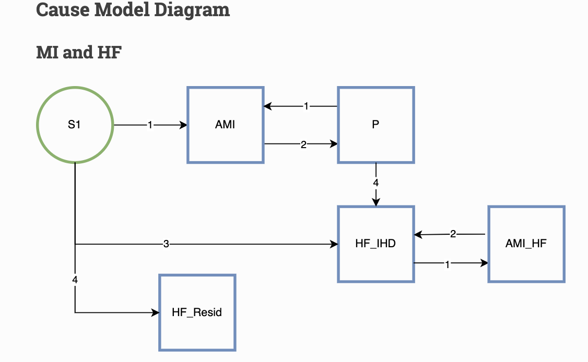
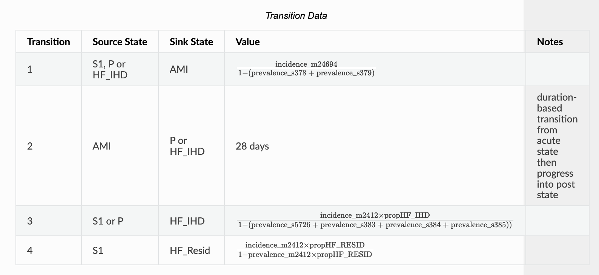

# IDs
- s378, s379: AMI sequelae
- m24694: MI due to IHD)
- m2412: HF envelope
- {s5726, s383, s384, s385}: HF from IHD

# Transition 1
- S1 -> AMI
- P -> AMI
- HF_IHD -> AMI_HF

The numerator is the incidence of 24694 (MI due to IHD).
We need to remove from the population (the denomiinator) of those
that cannot transition to AMI, ie those in HF_Resid state and those
already in AMI state (s378, s379
- [ ] add HF_Resid prevelance to denominator
# Transition 2
- AMI -> P
- AMI_HF -> HF_IHD

:thumbsup: Looks good

# Transition 3
- S1 -> HF_IHD
    - :exclamation: **typo?**
        - The S1->HF_IHD rate should be the same as P -> HF_IHD rate. ie switch lower-left 3 and 4 in the picture
- [ ] it should be S1 -> HF_Resid
Assuming S1 -> HF_Resid:
Seems like it should be changed. I think the numerator needs to use
(1-propHF_IHD) to be the residual HF incidence rate and then the
denominator needs to also include the AMI prevalences
- [ ] `incidence_m2412 * (1 - propHF_IHD) / [1 - (sum(prevalences HF from IHD) + sum(prevalences AMI))]`

# Transition 4
- P -> HF_IHD
- S1 -> HF_IHD (**after fix above**)
Assuming it's the currently-labeled 3,
- [ ] might be the wrong proportion?
